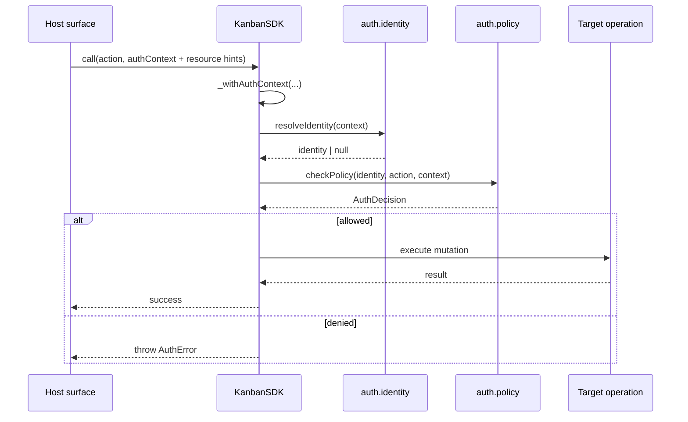

# Auth plugins and auth capabilities

This document is the detailed reference for Kanban Lite's auth system as it exists today in the codebase.

It explains:

- what the auth plugin capabilities are,
- how they are configured,
- how the SDK evaluates authorization,
- how each host surface passes tokens into the SDK,
- which actions are currently protected,
- what diagnostics are available,
- and what is intentionally **not** implemented yet.

This guide is deliberately more detailed than the short auth section in `README.md` and more implementation-focused than the ADR/plan documents under `docs/plan/20260320-auth-authz-plugin-architecture/`.

---

## Executive summary

Kanban Lite models auth as **two capability namespaces**:

- `auth.identity`
- `auth.policy`

Those capabilities are resolved by the SDK in the same general style as storage capabilities.

The key rule is:

> If no auth plugin is configured, behavior must not change.

That rule is preserved by **no-op** providers resolved from `kl-auth-plugin` when available (with a core compatibility fallback when the package is absent):

- `auth.identity: noop` → always resolves to anonymous (`null` identity)
- `auth.policy: noop` → always allows the action

The current release also ships a **starter RBAC** provider pair through `kl-auth-plugin`:

- `auth.identity: rbac` → validates opaque tokens against a runtime-owned principal registry
- `auth.policy: rbac` → enforces a fixed cumulative role matrix for `user`, `manager`, and `admin`

So a workspace with no auth configuration continues to behave exactly like an open-access workspace.

When a non-noop auth provider is active, the SDK performs **pre-action authorization** at the SDK method boundary before protected work executes.

---

## Design goals

The auth design is built around a few principles:

1. **SDK first**
	 - The SDK is the authoritative enforcement seam.
	 - REST, CLI, MCP, and the extension host must not implement their own allow/deny rules.

2. **Host-owned token acquisition**
	 - Each host decides where a token comes from.
	 - The SDK consumes a normalized `AuthContext`.

3. **No secrets in `.kanban.json`**
	 - Workspace config can select providers.
	 - It must not store bearer tokens or similar secret material.

4. **Action-level authorization only**
	 - Current authorization is based on named SDK actions.
	 - It does not do partial filtering of card lists or board lists.

5. **No-plugin = no behavior change**
	 - The default path remains anonymous + allow-all via `noop`, with a compatibility fallback when `kl-auth-plugin` is not installed yet.

---

## Capability model

Auth uses two capability namespaces defined in `src/shared/config.ts`:

- `AuthCapabilityNamespace = 'auth.identity' | 'auth.policy'`
- `AuthCapabilitySelections = Partial<Record<AuthCapabilityNamespace, ProviderRef>>`
- `ResolvedAuthCapabilities = Record<AuthCapabilityNamespace, ProviderRef>`

The same `ProviderRef` shape used by storage capabilities is reused here:

```ts
interface ProviderRef {
	provider: string
	options?: Record<string, unknown>
}
```

That means auth provider selection looks structurally like storage provider selection.

---

## The two auth capabilities

### `auth.identity`

Responsibility:

- take a host-supplied `AuthContext`,
- inspect token-related input,
- and resolve a normalized caller identity.

The runtime identity shape is defined in `src/sdk/plugins/index.ts`:

```ts
export interface AuthIdentity {
	subject: string
	roles?: string[]
}
```

Current shipped provider ids:

- `noop`
- `rbac`

Current `noop` behavior:

- always returns `null`
- treats the caller as anonymous
- preserves open-access behavior when no real identity plugin is active

Current `rbac` behavior:

- treats tokens as opaque strings
- strips a `Bearer ` prefix defensively before lookup
- resolves identity from a runtime-owned principal registry (`token -> { subject, roles }`)
- returns `null` for absent or unregistered tokens
- never infers roles from token text

Important implementation detail:

- the exported singleton `RBAC_IDENTITY_PLUGIN` is constructed with an **empty** principal registry
- that means selecting `auth.identity = rbac` resolves a real provider id, but no token will authenticate until the host/runtime supplies principal material via `createRbacIdentityPlugin(principals)` and injects that plugin through custom capability wiring

### `auth.policy`

Responsibility:

- receive the resolved identity,
- receive the canonical action name,
- receive the normalized `AuthContext`,
- return an allow/deny decision.

The decision shape is defined in `src/sdk/types.ts`:

```ts
export interface AuthDecision {
	allowed: boolean
	reason?: AuthErrorCategory
	actor?: string
	metadata?: Record<string, unknown>
}
```

Current shipped provider ids:

- `noop`
- `rbac`

Current `noop` behavior:

- always returns `{ allowed: true }`
- allows every protected action
- preserves open-access behavior when no real policy plugin is active

Current `rbac` behavior:

- denies `null` identity with `reason = 'auth.identity.missing'`
- checks the caller's roles against the fixed `RBAC_ROLE_MATRIX`
- returns `{ allowed: true, actor: identity.subject }` on success
- returns `{ allowed: false, reason: 'auth.policy.denied', actor: identity.subject }` when the action is outside the caller's role set
- implements three cumulative roles: `user`, `manager`, and `admin`

---

## Current implementation status

This part is important because the **architecture** is slightly broader than the **currently shipped resolver behavior**.

### What exists today

Today the codebase includes:

- auth capability types in config,
- auth plugin interfaces,
- `kl-auth-plugin` package-backed no-op identity/policy providers,
- a package-backed starter `rbac` identity/policy provider pair,
- the exported `createRbacIdentityPlugin(principals)` helper for runtime-backed token validation,
- the fixed `RBAC_USER_ACTIONS`, `RBAC_MANAGER_ACTIONS`, `RBAC_ADMIN_ACTIONS`, and `RBAC_ROLE_MATRIX` exports,
- SDK auth status reporting,
- SDK pre-action authorization hooks,
- normalized host `AuthContext` wiring for standalone, CLI, MCP, and extension host surfaces,
- auth diagnostics/status endpoints and commands,
- tests for the auth seam and host wiring.

### What is still intentionally limited

In the current core resolver implementation, the shipped auth compatibility ids are:

- `auth.identity.provider = "noop" | "rbac"`
- `auth.policy.provider = "noop" | "rbac"`

If another auth provider id is selected, the resolver treats it as an external package name and throws an actionable install/shape error when the package cannot be loaded.

So the system now has:

- the **capability contract**,
- the **SDK enforcement seam**,
- the built-in **starter RBAC** policy implementation,
- and the **host integration path for token acquisition**,

but it is still intentionally limited in two important ways:

1. The shipped compatibility ids are still just `noop` and `rbac`; turnkey multi-provider auth packaging remains deliberately small.
2. The shipped `RBAC_IDENTITY_PLUGIN` singleton uses an empty registry, so real token validation requires host/runtime wiring via `createRbacIdentityPlugin(principals)`.

That distinction matters for docs, operators, and plugin authors: this is a shipped starter RBAC contract, not a turnkey login system.

---

## Configuration

Auth provider selection lives in `.kanban.json` under the `auth` key.

### Current safe/default config

```json
{
	"auth": {
		"auth.identity": { "provider": "noop" },
		"auth.policy": { "provider": "noop" }
	}
}
```

### Starter RBAC config

```json
{
	"auth": {
		"auth.identity": { "provider": "rbac" },
		"auth.policy": { "provider": "rbac" }
	}
}
```

What this does in the current implementation:

- switches both auth capability ids to the `kl-auth-plugin` RBAC provider pair
- enables action-level authorization using the fixed SDK-owned role matrix
- requires the host/runtime to provide the principal registry used by `createRbacIdentityPlugin(principals)` if you want any token to resolve successfully

What this does **not** do:

- it does not store token-to-role mappings in `.kanban.json`
- it does not create a login flow
- it does not make the empty-registry `RBAC_IDENTITY_PLUGIN` singleton accept arbitrary token text

### Shape of auth config

```json
{
	"auth": {
		"auth.identity": {
			"provider": "noop",
			"options": {}
		},
		"auth.policy": {
			"provider": "noop",
			"options": {}
		}
	}
}
```

### Normalization behavior

`normalizeAuthCapabilities()` in `src/shared/config.ts` guarantees that both auth namespaces are always resolved.

If `auth` is omitted entirely, the normalized result is:

```json
{
	"auth.identity": { "provider": "noop" },
	"auth.policy": { "provider": "noop" }
}
```

So there is always a complete runtime auth capability map, even when the workspace has no auth config.

### What must never go in `.kanban.json`

Do **not** store:

- bearer tokens,
- refresh tokens,
- session secrets,
- API keys used as auth credentials,
- cookies,
- or any other secret credential material.

`.kanban.json` is for provider **selection/configuration**, not secret storage.

---

## Auth plugin contracts

The core auth plugin contracts live in `src/sdk/plugins/index.ts`.

### Identity plugin contract

```ts
export interface AuthIdentityPlugin {
	readonly manifest: AuthPluginManifest
	resolveIdentity(context: AuthContext): Promise<AuthIdentity | null>
}
```

### Policy plugin contract

```ts
export interface AuthPolicyPlugin {
	readonly manifest: AuthPluginManifest
	checkPolicy(
		identity: AuthIdentity | null,
		action: string,
		context: AuthContext
	): Promise<AuthDecision>
}
```

### Auth plugin manifest

```ts
export interface AuthPluginManifest {
	readonly id: string
	readonly provides: readonly AuthCapabilityNamespace[]
}
```

That means an auth plugin identifies itself by:

- a provider id,
- and the auth namespace(s) it implements.

### Starter RBAC helper contract

The built-in starter RBAC implementation also exports a small runtime helper contract:

```ts
export interface RbacPrincipalEntry {
	subject: string
	roles: string[]
}

export function createRbacIdentityPlugin(
	principals: ReadonlyMap<string, RbacPrincipalEntry>,
): AuthIdentityPlugin
```

That helper is the runtime-backed identity path for the shipped `rbac` provider:

- keys are opaque tokens
- values contain the resolved caller `subject` and `roles`
- unknown tokens resolve to `null`
- roles come from runtime-owned data, not token parsing

The built-in singleton `RBAC_IDENTITY_PLUGIN` simply calls this helper with `new Map()`.

---

## Starter RBAC provider

The current shipped RBAC contract is intentionally small and fixed.

### Canonical roles

- `user`
- `manager`
- `admin`

Roles are cumulative upward:

- `manager` includes every `user` action
- `admin` includes every `manager` and `user` action

### Identity-side behavior

- token validation is runtime-owned
- token values are opaque strings
- a defensive `Bearer ` prefix strip happens before the registry lookup
- the resolved identity shape is still just:

```ts
{ subject: string, roles?: string[] }
```

### Policy-side behavior

The built-in `rbac` policy provider consumes `RBAC_ROLE_MATRIX`.

- `null` identity → deny with `auth.identity.missing`
- action not covered by the caller's role set → deny with `auth.policy.denied`
- allowed action → returns the caller subject as `actor`

### Runtime boundary

The current built-in RBAC provider is **Node-hosted only**.

- hosts are responsible for token acquisition
- hosts are responsible for any runtime principal material
- the webview is not an auth plugin host
- `.kanban.json` selects providers but does not contain token registries or secrets

---

## The auth context passed into the SDK

Hosts normalize token-related information into `AuthContext` from `src/sdk/types.ts`.

Important fields include:

- `token?: string`
- `tokenSource?: string`
- `transport?: string`
- `actorHint?: string`
- `boardId?: string`
- `cardId?: string`
- `fromBoardId?: string`
- `toBoardId?: string`
- `columnId?: string`
- `commentId?: string`
- `formId?: string`
- `attachment?: string`
- `labelName?: string`
- `webhookId?: string`
- `actionKey?: string`

### Why `AuthContext` exists

It gives the SDK one transport-neutral structure so the same authorization seam can work across:

- HTTP requests,
- WebSocket calls,
- CLI commands,
- MCP tools,
- and extension-host actions.

### What the fields are for

- `token` is the write-only credential input for identity resolution.
- `tokenSource` is diagnostics-only metadata such as `request-header`, `env`, or `secret-storage`.
- `transport` identifies the surface such as `http`, `cli`, `mcp`, or `extension`.
- resource hint fields let the policy plugin evaluate context-rich actions like:
	- deleting a specific card,
	- renaming a specific label,
	- transferring between boards,
	- submitting a specific form,
	- or triggering a named action.

---

## SDK runtime flow

The auth runtime is centered in `src/sdk/KanbanSDK.ts`.

### Step 1: resolve configured auth capabilities

During SDK construction, auth capabilities are resolved via workspace config normalization.

### Step 2: resolve capability bag

The resolved capability bag contains both:

- `authIdentity`
- `authPolicy`

If no auth config is present, both are no-op plugins.

### Step 3: method calls enter the authorization seam

Protected SDK methods call:

- `_withAuthContext(...)` to merge resource hints into the inbound context
- `_authorizeAction(action, context)` before side effects happen

### Step 4: identity resolution happens first

`_authorizeAction()` calls:

```ts
const identity = await this._capabilities.authIdentity.resolveIdentity(resolvedContext)
```

### Step 5: policy evaluation happens second

Then it calls:

```ts
const decision = await this._capabilities.authPolicy.checkPolicy(identity, action, resolvedContext)
```

### Step 6: denial throws a typed `AuthError`

If `decision.allowed` is false, the SDK throws `AuthError`.

That is what host surfaces use to map errors to:

- HTTP status codes,
- CLI output,
- MCP tool errors,
- and extension-host messages.

---

## Sequence diagram



---

## Auth decisions and error categories

`AuthErrorCategory` in `src/sdk/types.ts` defines the canonical auth failure vocabulary.

Current categories are:

- `auth.identity.missing`
- `auth.identity.invalid`
- `auth.identity.expired`
- `auth.policy.denied`
- `auth.policy.unknown`
- `auth.provider.error`

### Why categories matter

These categories let hosts map failures without parsing fragile human-readable strings.

Examples:

- HTTP can turn identity failures into `401`
- HTTP can turn deny failures into `403`
- CLI can print a targeted auth message
- MCP can return machine-usable tool errors

### `AuthError`

`AuthError` is the typed SDK error used when a protected action is denied.

It carries:

- a machine-readable category,
- a human-readable message,
- and optional actor information.

---

## Current protected action surface

The current implementation protects the following SDK operations with `_authorizeAction(...)`.

### Built-in RBAC role matrix

#### `user`

- `form.submit`
- `comment.create`
- `comment.update`
- `comment.delete`
- `attachment.add`
- `attachment.remove`
- `card.action.trigger`
- `log.add`

#### `manager`

Includes all `user` actions plus:

- `card.create`
- `card.update`
- `card.move`
- `card.transfer`
- `card.delete`
- `board.action.trigger`
- `log.clear`
- `board.log.add`

#### `admin`

Includes all `manager` and `user` actions plus:

- `board.create`
- `board.update`
- `board.delete`
- `settings.update`
- `webhook.create`
- `webhook.update`
- `webhook.delete`
- `label.set`
- `label.rename`
- `label.delete`
- `column.create`
- `column.update`
- `column.reorder`
- `column.setMinimized`
- `column.delete`
- `column.cleanup`
- `board.action.config.add`
- `board.action.config.remove`
- `board.log.clear`
- `board.setDefault`
- `storage.migrate`
- `card.purgeDeleted`

### Same surface grouped by operation area

#### Board actions

- `board.create`
- `board.update`
- `board.delete`
- `board.setDefault`
- `board.action.config.add`
- `board.action.config.remove`
- `board.action.trigger`
- `board.log.add`
- `board.log.clear`

#### Card actions

- `card.create`
- `card.update`
- `card.move`
- `card.delete`
- `card.transfer`
- `card.purgeDeleted`
- `card.action.trigger`

#### Form actions

- `form.submit`

#### Attachment actions

- `attachment.add`
- `attachment.remove`

#### Comment actions

- `comment.create`
- `comment.update`
- `comment.delete`

#### Log actions

- `log.add`
- `log.clear`

#### Column actions

- `column.create`
- `column.update`
- `column.reorder`
- `column.setMinimized`
- `column.delete`
- `column.cleanup`

#### Label actions

- `label.set`
- `label.rename`
- `label.delete`

#### Settings and storage actions

- `settings.update`
- `storage.migrate`

#### Webhook actions

- `webhook.create`
- `webhook.update`
- `webhook.delete`

### Important note on scope

Not every synchronous/local mutation path in the codebase is currently routed through the auth seam.

For example, the current action-protected surface is focused on the **privileged async mutation seam** already used by the Node-hosted adapters. The action matrix above is the authoritative list of what is currently protected.

This doc intentionally describes the implementation as it exists now, not as an aspirational superset.

---

## How `_withAuthContext()` is used

The SDK does not expect hosts to attach every resource hint manually.

Instead, SDK methods enrich the context before policy evaluation.

Examples:

- `deleteCard(cardId, boardId, auth)` adds `cardId` and `boardId`
- `transferCard(...)` adds `cardId`, `fromBoardId`, `toBoardId`, and `columnId`
- `updateComment(...)` adds `cardId`, `boardId`, and `commentId`
- `submitForm(...)` adds `boardId`, `cardId`, and `formId`

This keeps host adapters thin while still giving policy plugins rich context.

---

## Host token acquisition and auth context sources

Each host surface is responsible for creating `AuthContext`.

### Standalone HTTP API

Source file:

- `src/standalone/authUtils.ts`

Behavior:

- reads `Authorization: Bearer <token>`
- strips the `Bearer ` prefix
- produces:

```ts
{ token, tokenSource: 'request-header', transport: 'http' }
```

If no bearer token is present:

```ts
{ transport: 'http' }
```

### Standalone WebSocket

The standalone WebSocket path also extracts auth context from the upgrade request and threads that same context into WebSocket-triggered mutations.

That means browser-triggered socket actions and REST mutations use the same token source model on the standalone server.

### CLI

Source file:

- `src/cli/index.ts`

Behavior:

- reads `process.env.KANBAN_TOKEN`
- if present, produces:

```ts
{ token, tokenSource: 'env', transport: 'cli' }
```

- otherwise:

```ts
{ transport: 'cli' }
```

The CLI also has an auth status command:

- `kl auth status`

### MCP server

Source file:

- `src/mcp-server/index.ts`

Behavior:

- reads `process.env.KANBAN_TOKEN`
- if present, produces:

```ts
{ token, tokenSource: 'env', transport: 'mcp' }
```

- otherwise:

```ts
{ transport: 'mcp' }
```

The MCP server exposes auth diagnostics via:

- `get_auth_status`

### VS Code extension host

Source files:

- `src/extension/auth.ts`
- `src/extension/index.ts`

Behavior:

- stores the token in VS Code `SecretStorage`
- secret key: `kanban-lite.authToken`
- produces:

```ts
{ token, tokenSource: 'secret-storage', transport: 'extension' }
```

or, when no token is stored:

```ts
{ transport: 'extension' }
```

Extension commands:

- `Kanban Lite: Set Auth Token`
- `Kanban Lite: Clear Auth Token`

Important boundary:

- the token stays in the Node extension host
- raw token material is not supposed to flow into the webview bundle

---

## Diagnostics and status surfaces

There are two layers of auth diagnostics.

### SDK-level status

`sdk.getAuthStatus()` returns:

- `identityProvider`
- `policyProvider`
- `identityEnabled`
- `policyEnabled`

This tells you which provider ids are active and whether they are non-noop.

### Host-augmented status

Each host adds transport/token-source diagnostics on top of `sdk.getAuthStatus()`.

Typical extra fields are:

- `configured`
- `tokenPresent`
- `tokenSource`
- `transport`

These status surfaces do **not** reveal token contents or the RBAC principal registry. They report safe metadata only: provider ids, whether auth is configured, whether a token is currently present, and the token-source / transport labels.

### Standalone REST diagnostics

Endpoints:

- `GET /api/auth`
- `GET /api/workspace`

These expose safe auth metadata only.

### CLI diagnostics

Command:

- `kl auth status`

This prints:

- identity provider id
- policy provider id
- whether auth is configured
- whether a token is present
- token source label
- transport label

### MCP diagnostics

Tool:

- `get_auth_status`

### Extension diagnostics

The extension computes auth status in the host and passes safe metadata to the UI state for display/awareness.

---

## HTTP error mapping

The standalone auth utility maps `AuthError` categories to HTTP status codes.

Current mapping in `src/standalone/authUtils.ts`:

- `auth.identity.missing` → `401`
- `auth.identity.invalid` → `401`
- `auth.identity.expired` → `401`
- `auth.policy.denied` → `403`
- `auth.policy.unknown` → `403`
- everything else → `500`

That mapping is intentionally category-based rather than string-based.

---

## Security guarantees in the current design

The current implementation makes several explicit promises.

### 1. Tokens are host inputs, not workspace config

Tokens are acquired from:

- request headers,
- environment variables,
- or VS Code `SecretStorage`.

They are not stored in `.kanban.json`.

### 2. Tokens are write-only

Raw tokens are intended to be consumed for identity resolution and not re-exposed.

They should not appear in:

- REST responses,
- CLI output,
- MCP output,
- logs,
- denial messages,
- or webview messages.

### 3. The webview is not an auth plugin host

Auth plugins are for Node-hosted surfaces.

The webview does not execute auth logic directly.

### 4. Policy is centralized

The SDK is the only authoritative allow/deny layer.

This avoids parity drift between:

- standalone server,
- CLI,
- MCP,
- and extension host behavior.

---

## Reference examples

### Minimal open-access workspace

No auth config at all:

```json
{
	"version": 2,
	"defaultBoard": "default",
	"boards": {
		"default": {
			"name": "Default",
			"columns": [
				{ "id": "backlog", "name": "Backlog", "color": "#6b7280" }
			],
			"nextCardId": 1,
			"defaultStatus": "backlog",
			"defaultPriority": "medium"
		}
	},
	"kanbanDirectory": ".kanban",
	"defaultPriority": "medium",
	"defaultStatus": "backlog",
	"nextCardId": 1
}
```

Normalized auth result:

- `auth.identity = noop`
- `auth.policy = noop`

### Explicitly declaring noop auth

```json
{
	"auth": {
		"auth.identity": { "provider": "noop" },
		"auth.policy": { "provider": "noop" }
	}
}
```

This is functionally equivalent to omitting the `auth` block.

### Selecting the built-in starter RBAC provider pair

```json
{
	"auth": {
		"auth.identity": { "provider": "rbac" },
		"auth.policy": { "provider": "rbac" }
	}
}
```

This enables the built-in RBAC provider ids, but successful identity resolution still depends on runtime-owned principal data.

### Example runtime principal registry

```ts
const principals = new Map([
	['opaque-admin-abc', { subject: 'alice', roles: ['admin'] }],
	['opaque-mgr-xyz', { subject: 'bob', roles: ['manager'] }],
	['opaque-user-tok', { subject: 'carol', roles: ['user'] }],
])

const identityPlugin = createRbacIdentityPlugin(principals)
```

This helper-backed plugin validates tokens against runtime-owned data.

- unknown tokens resolve to `null`
- roles come from the registry entry
- token text is never parsed for role inference

### Example host token usage

Standalone REST:

```http
GET /api/auth HTTP/1.1
Authorization: Bearer <token>
```

CLI:

```sh
KANBAN_TOKEN=example-token kl auth status
```

MCP:

```sh
KANBAN_TOKEN=example-token kanban-mcp
```

---

## Limitations and non-goals

The following are not currently implemented as a completed shared feature set.

### No dynamic external auth provider loading yet

The current resolver supports two built-in auth provider ids:

- `noop`
- `rbac`

But it does **not** yet dynamically load arbitrary external auth providers.

Also, the exported `RBAC_IDENTITY_PLUGIN` singleton uses an empty registry by default, so a host/runtime must provide principal material through `createRbacIdentityPlugin(principals)` if it wants real token validation.

### No row/card filtering

Auth currently does not rewrite or filter list/query results.

If a protected action is denied, the system returns an error rather than silently filtering results.

### No browser login UX contract

There is no standardized shared login flow such as OAuth popup or browser-mediated refresh flow.

### No token refresh contract

Refresh behavior is not part of the shared auth contract.

### No universal host-side token precedence framework

Current host token handling exists and is normalized into `AuthContext`, but the full future story for multi-source precedence and richer auth UX is still intentionally limited.

---

## Relationship to storage capabilities

Auth capabilities are separate from storage capabilities.

Current storage capabilities:

- `card.storage`
- `attachment.storage`

Current auth capabilities:

- `auth.identity`
- `auth.policy`

They share the same broad configuration style and capability-resolution pattern, but they solve different problems:

- storage decides **where data lives**
- auth decides **who may perform protected actions**

---

## Where to look in the codebase

If you want the implementation source of truth, start here:

### Config and capability types

- `src/shared/config.ts`

### Auth plugin contracts and noop implementations

- `src/sdk/plugins/index.ts`

### Auth context, decisions, and errors

- `src/sdk/types.ts`

### SDK auth runtime and protected action hooks

- `src/sdk/KanbanSDK.ts`

### Standalone auth utilities

- `src/standalone/authUtils.ts`

### CLI auth adapter

- `src/cli/index.ts`

### MCP auth adapter

- `src/mcp-server/index.ts`

### VS Code extension auth adapter

- `src/extension/auth.ts`
- `src/extension/index.ts`

### Tests

- `src/sdk/__tests__/plugin-registry.test.ts`
- `src/sdk/__tests__/auth-enforcement.test.ts`
- `src/standalone/__tests__/server.integration.test.ts`

### Planning and architecture docs

- `docs/plan/20260320-auth-authz-plugin-architecture/architecture-decision-record.md`
- `docs/plan/20260320-auth-authz-plugin-architecture/architecture-requirements-stage-2.md`

---

## Final mental model

If you only remember five things, remember these:

1. Auth is split into **identity** and **policy** capabilities.
2. Both default to **noop**, so existing workspaces remain open unless auth is explicitly activated.
3. The SDK is the **only authoritative enforcement seam**.
4. Hosts supply tokens via `AuthContext`, but secrets do **not** belong in `.kanban.json`.
5. The current release ships `noop` plus a built-in starter `rbac` provider pair, but live RBAC identity resolution still depends on runtime-owned principal data rather than anything stored in `.kanban.json`.
