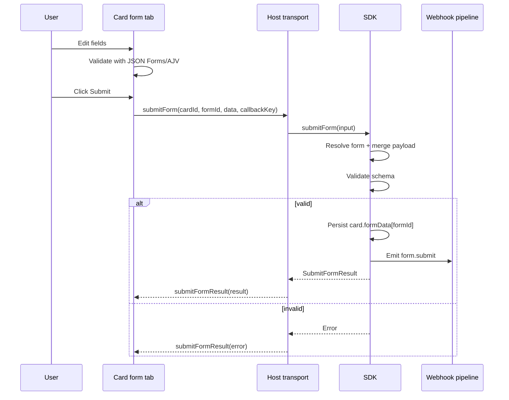

# Card Forms

Card forms let a card carry one or more structured data-entry tabs backed by JSON Schema and rendered with [JSON Forms](https://jsonforms.io/).

They are designed for workflows where free-form markdown is not enough: incident reports, release checklists, QA sign-off, deployment approvals, intake forms, and other repeatable data capture.

This guide explains the feature end-to-end:

- where forms are declared
- how forms are attached to cards
- how form IDs and labels are resolved
- how initial values are merged
- how validation works
- how data is persisted
- how submissions emit the `form.submit` webhook event
- how to work with the feature via the UI, CLI, REST API, and MCP

---

## At a glance

A card form has three conceptual layers:

1. **Definition**
   - A reusable workspace form in `.kanban.json` under `forms.<name>`
   - or an inline form definition attached directly to a card

2. **Attachment**
   - A card declares which forms it uses via `forms` in card frontmatter

3. **State**
   - Submitted values are persisted per card under `formData[formId]`

At runtime, Kanban Lite resolves each attachment into a normalized form descriptor with:

- a stable `id`
- a display `label`
- a resolved JSON Schema
- an optional JSON Forms UI schema
- merged `initialData`
- a `fromConfig` flag

---

## What problem card forms solve

Markdown is great for narrative text, but many workflows need structured fields:

- required values
- typed inputs
- repeatable checklists
- layout hints
- validation before submission
- machine-readable payloads for automation

Card forms add this structure without removing the existing markdown workflow. A single card can still contain:

- markdown content
- comments
- logs
- actions
- and now one or more **form tabs**

The fixed card tabs remain:

- `write`
- `preview`
- `comments`
- `logs`

Each attached form contributes an additional dynamic tab using the route format:

- `form:<resolved-form-id>`

---

## Architecture overview

```mermaid
flowchart LR
  A[.kanban.json\nforms.<name>] --> D[Resolved form descriptor]
  B[Card frontmatter\nforms[]] --> D
  C[Card frontmatter\nformData] --> D
  E[Card metadata] --> D
  D --> F[Dynamic card tab]
  F --> G[JSON Forms renderer]
  G --> H[Validated submit]
  H --> I[Persist formData[formId]]
  I --> J[Emit form.submit]
```

---

## Core concepts

### Workspace form definitions

Reusable forms live in `.kanban.json` under the root-level `forms` object.

These forms are **workspace-scoped**. They are surfaced through board info at runtime, but the source of truth is the workspace config, not an individual board.

Each reusable form is a `FormDefinition` with:

- `schema`: required JSON Schema object
- `ui`: optional JSON Forms UI schema
- `data`: optional default values

Example:

```json
{
  "forms": {
    "incident-report": {
      "schema": {
        "type": "object",
        "title": "Incident Report",
        "required": ["severity", "summary"],
        "properties": {
          "severity": {
            "type": "string",
            "enum": ["low", "medium", "high", "critical"]
          },
          "summary": {
            "type": "string",
            "minLength": 1
          },
          "owner": {
            "type": "string"
          }
        }
      },
      "ui": {
        "type": "VerticalLayout",
        "elements": [
          { "type": "Control", "scope": "#/properties/severity" },
          { "type": "Control", "scope": "#/properties/summary", "options": { "multi": true } },
          { "type": "Control", "scope": "#/properties/owner" }
        ]
      },
      "data": {
        "severity": "medium"
      }
    }
  }
}
```

### Card form attachments

A card opts into forms through the `forms` array in its frontmatter.

Each item is a `CardFormAttachment`.

Supported shapes:

#### 1. Named reusable form reference

```yaml
forms:
  - name: incident-report
```

#### 2. String shorthand for a named form

String shorthand is supported and normalizes to `{ name: "..." }`.

```yaml
forms:
  - incident-report
  - "qa-signoff"
```

#### 3. Inline card-local form

```yaml
forms:
  - schema:
      type: object
      title: Release Checklist
      required:
        - owner
      properties:
        owner:
          type: string
        approved:
          type: boolean
    ui:
      type: VerticalLayout
      elements:
        - type: Control
          scope: "#/properties/owner"
        - type: Control
          scope: "#/properties/approved"
    data:
      approved: false
```

#### 4. Named form with attachment-level overrides

When both `name` and inline fields are present, the attachment uses the named config form as a base and overrides parts of it.

```yaml
forms:
  - name: incident-report
    data:
      severity: high
```

Important resolution rules:

- Either `name` or `schema` must be present.
- If both are present, the attachment’s inline `schema` wins over the config schema.
- Attachment-level `ui` wins over config `ui`.
- Attachment-level `data` is merged after config-level `data`.

### Per-card persisted form data

Submitted values are stored on the card in `formData`, keyed by resolved form ID.

```yaml
formData:
  incident-report:
    severity: critical
    summary: API outage in eu-west
    owner: alice
```

This isolation is deliberate: two forms on one card can both contain a field named `status` without colliding, because persistence is namespaced by form ID.

---

## Runtime resolution model

Kanban Lite does not render raw attachments directly. It first resolves them into a normalized runtime shape.

A resolved form descriptor contains:

- `id`
- `label`
- `schema`
- `ui` (optional)
- `initialData`
- `fromConfig`

### Resolved form ID rules

Resolved IDs matter because they control:

- tab routes
- persistence keys in `formData`
- submission targets (`formId`)

Resolution rules:

#### Named reusable form

If the attachment references a reusable form by `name`, the resolved ID is the form name.

Example:

- attachment: `{ name: "incident-report" }`
- resolved ID: `incident-report`

#### Inline form

If the form is inline only:

- Kanban Lite tries to slugify `schema.title`
- if there is no usable title, it falls back to `form-<index>`

Examples:

- `title: "Release Checklist"` → `release-checklist`
- no title on the second inline form → `form-1`

#### Duplicate inline titles

If multiple inline forms resolve to the same base ID, later ones receive a numeric suffix.

Example:

- first: `release-checklist`
- second: `release-checklist-2`

### Form labels

Labels shown in the card UI are resolved as follows:

- named form: uses the attachment `name`
- otherwise, if a config schema title exists, it may be used for display
- inline form: uses `schema.title`
- fallback: resolved `id`

### When a form is renderable

A form tab is only created when the attachment can resolve to a schema.

That means:

- inline attachment with `schema` → renderable
- named attachment whose config form exists and has `schema` → renderable
- named attachment with missing config form → **not renderable**

Kanban Lite does **not** rely on JSON Forms schema generation. The app expects a real schema to exist before a form becomes a usable tab.

---

## Initial data merge order

The resolved form descriptor includes `initialData`, which is the prefilled state shown when the form tab opens.

Current merge order, from lowest to highest priority:

1. workspace config defaults: `KanbanConfig.forms[formName].data`
2. attachment defaults: `attachment.data`
3. persisted card form data: `card.formData[formId]`
4. matching card metadata fields: `card.metadata[key]`, **only** for keys declared in `schema.properties`

In other words, metadata can intentionally overlay earlier values, but only for schema-declared fields.

### Metadata overlay behavior

Metadata is not copied wholesale into the form.

Only metadata keys that exist in the form schema’s `properties` are merged.

If a card contains:

```yaml
metadata:
  owner: alice
  ignored: true
```

and the schema properties are only:

- `owner`
- `severity`

then only `owner` is merged into `initialData`. `ignored` is skipped.

### Example initial-data resolution

Given:

- config defaults:
  - `severity: low`
  - `title: Config Title`
- attachment defaults:
  - `severity: medium`
- persisted form data:
  - `severity: high`
- metadata:
  - `title: Metadata Title`

The resulting `initialData` is:

```json
{
  "title": "Metadata Title",
  "severity": "high"
}
```

Why?

- config seeds the base
- attachment overrides config
- persisted form data overrides attachment
- metadata overlays schema-matching keys last

---

## Submission merge and validation

Submitting a form is not just “send the current visible fields.” The SDK builds and validates the canonical payload.

### Submission merge order

When a submission is triggered, the SDK starts from the resolved `initialData` and merges the submitted payload on top.

Effective order, from lowest to highest priority:

1. config form defaults
2. attachment defaults
3. persisted card form data
4. schema-matching card metadata
5. submitted payload

### Why validation is authoritative in the SDK

The UI performs immediate validation for good UX, but the SDK is the source of truth.

The SDK:

- resolves the target form
- merges the final payload
- validates against the resolved schema
- persists only if validation succeeds
- emits `form.submit` only after a successful write

This guarantees identical rules across:

- webview UI
- standalone browser UI
- CLI
- REST API
- MCP

### Validation engine

Kanban Lite uses AJV through JSON Forms’ `createAjv` helper with:

- `allErrors: true`
- `strict: false`

In the card form tab, JSON Forms is rendered with:

- `validationMode="ValidateAndShow"`

That means the UI both validates and shows validation errors while editing.

### UI validation behavior

The card form tab:

- validates the initial payload immediately
- disables the **Submit** button if validation errors exist
- renders a summary block listing validation issues
- formats missing-property style messages into clearer text

Example displayed state:

- header text: `Fix 1 validation error before submitting.`
- validation panel: `Validation issues`
- submit button: disabled until valid

### SDK validation failure behavior

If validation fails in the SDK:

- persistence does not occur
- `form.submit` is not emitted
- callers receive an error

---

## Persistence model

Successful submissions are written back to the card under:

```yaml
formData:
  <resolved-form-id>: { ...validatedPayload }
```

This means:

- each form gets its own persisted object
- future tab opens use that object as part of initial data resolution
- cards can safely attach multiple forms with overlapping field names

### Example persisted card frontmatter

```yaml
---
version: "1"
id: "230"
status: "backlog"
priority: "medium"
assignee: null
dueDate: null
created: "2026-03-20T00:00:00.000Z"
modified: "2026-03-20T00:10:00.000Z"
completedAt: null
labels: []
attachments: []
order: "a0"
metadata:
  reporter: alice
forms:
  - incident-report
  - schema:
      type: object
      title: Release Checklist
      properties:
        approved:
          type: boolean
formData:
  incident-report:
    severity: high
    summary: API outage
    reporter: alice
  release-checklist:
    approved: true
---
# Investigate outage
```

---

## UI behavior

### Dynamic card tabs

The card editor always includes the fixed tabs:

- `write`
- `preview`
- `comments`
- `logs`

Attached forms add dynamic tabs using `form:<id>`.

Examples:

- `form:incident-report`
- `form:release-checklist`
- `form:release-checklist-2`

Deep links and internal tab state preserve these dynamic IDs so the correct form tab stays selected when possible.

### Shared badge

When a resolved form comes from workspace config, the card form tab shows a **Shared** badge.

This indicates the form is backed by a reusable definition rather than existing only inline on that card.

### JSON Forms renderer set

Kanban Lite renders forms with:

- `@jsonforms/react`
- `@jsonforms/vanilla-renderers`

The rendered form is wrapped in a `.card-jsonforms` container so theme-aware CSS can style the vanilla renderer output consistently inside the app.

This scoped styling covers layout, labels, controls, validation messages, arrays, groups, and focus states.

### Success and error feedback

After submit:

- a successful save shows a confirmation message like `Saved Incident Report`
- transport or SDK failures show an error message block
- validation issues remain visible until resolved

### Standalone offline behavior

In standalone mode, form submission fails immediately while disconnected.

Instead of leaving the UI in an indefinite pending state, the frontend receives a transport error:

- `You are offline. Form submissions are unavailable until the standalone backend reconnects.`

This behavior is specific to the standalone/browser transport path.

---

## Submit flow



---

## Webhook behavior

Successful form submissions emit the SDK event type:

- `form.submit`

The emitted payload includes:

- `boardId`
- sanitized `card` snapshot
- resolved `form` descriptor
- canonical validated `data`

### Event payload shape

Conceptually:

```json
{
  "boardId": "default",
  "card": {
    "id": "230",
    "status": "backlog",
    "forms": [{ "name": "incident-report" }],
    "formData": {
      "incident-report": {
        "severity": "high",
        "summary": "API outage"
      }
    }
  },
  "form": {
    "id": "incident-report",
    "label": "incident-report",
    "schema": { "type": "object", "properties": { "severity": { "type": "string" } } },
    "initialData": {
      "severity": "medium"
    },
    "fromConfig": true
  },
  "data": {
    "severity": "high",
    "summary": "API outage"
  }
}
```

### Important webhook guarantee

`form.submit` is emitted **after** persistence succeeds.

That means the webhook consumer sees the same payload that was actually stored on the card.

---

## Authoring reusable forms in `.kanban.json`

### Smallest valid reusable form

```json
{
  "forms": {
    "checklist": {
      "schema": {
        "type": "object",
        "properties": {
          "done": { "type": "boolean" }
        }
      }
    }
  }
}
```

### Reusable form with layout and defaults

```json
{
  "forms": {
    "qa-signoff": {
      "schema": {
        "type": "object",
        "title": "QA Sign-off",
        "required": ["owner", "result"],
        "properties": {
          "owner": { "type": "string" },
          "result": {
            "type": "string",
            "enum": ["pass", "fail", "blocked"]
          },
          "notes": { "type": "string" }
        }
      },
      "ui": {
        "type": "VerticalLayout",
        "elements": [
          { "type": "Control", "scope": "#/properties/owner" },
          { "type": "Control", "scope": "#/properties/result" },
          { "type": "Control", "scope": "#/properties/notes", "options": { "multi": true } }
        ]
      },
      "data": {
        "result": "blocked"
      }
    }
  }
}
```

### UI schema notes

JSON Forms UI schema is optional. If omitted, JSON Forms can generate a default UI layout from the JSON Schema.

Kanban Lite passes the resolved `ui` directly to JSON Forms, so common JSON Forms UI schema features are available, including:

- controls
- layouts
- rules
- renderer-specific `options`

JSON Forms documentation for UI schema concepts:

- controls
- layouts
- rules

---

## Attaching forms to cards

### Reusable form by name

```yaml
forms:
  - incident-report
```

### Multiple reusable forms

```yaml
forms:
  - incident-report
  - qa-signoff
```

### Inline form on a single card

```yaml
forms:
  - schema:
      type: object
      title: Approval
      required:
        - approver
      properties:
        approver:
          type: string
        notes:
          type: string
```

### Reusable form with card-specific defaults

```yaml
forms:
  - name: incident-report
    data:
      severity: critical
```

### Reusable form with a card-local schema override

```yaml
forms:
  - name: incident-report
    schema:
      type: object
      title: Incident Report Override
      properties:
        severity:
          type: string
        region:
          type: string
```

When you override the schema inline, that schema becomes authoritative for validation and rendering on that card.

---

## Working with metadata-driven prefills

Card metadata can seed form fields, but only if the schema explicitly declares those field names.

Example card:

```yaml
metadata:
  reporter: alice
  region: eu-west
  internalOnly: true
forms:
  - name: incident-report
```

If the form schema defines `reporter` and `region` but not `internalOnly`, then the resolved initial data includes:

- `reporter: alice`
- `region: eu-west`

and excludes:

- `internalOnly`

This makes metadata useful for:

- inheriting card context into forms
- avoiding duplicate data entry
- keeping automation fields machine-readable

---

## CLI usage

### Create a card with attached forms

```bash
kl add --title "Investigate outage" --forms '[{"name":"incident-report"}]'
```

### Update form attachments on an existing card

```bash
kl edit investigate-outage --forms @forms.json
```

### Seed persisted form data

```bash
kl edit investigate-outage --form-data @form-data.json
```

### Submit a form

```bash
kl form submit investigate-outage incident-report --data '{"severity":"high","owner":"alice"}'
```

### CLI behavior notes

- `--forms` expects a JSON array
- `--form-data` expects a JSON object keyed by resolved form ID
- `form submit` requires both `<card-id>` and `<form-id>`
- `--data` is required for `form submit` and must parse to a JSON object

When successful, the CLI prints either:

- a success message, or
- the full JSON result when `--json` is used

---

## REST API usage

### Create a card with forms

`POST /api/boards/:boardId/tasks`

Example body:

```json
{
  "content": "# Investigate outage",
  "forms": [
    { "name": "incident-report" }
  ],
  "formData": {
    "incident-report": {
      "severity": "high"
    }
  }
}
```

### Update a card’s forms

`PUT /api/boards/:boardId/tasks/:id`

Example body:

```json
{
  "forms": [
    { "name": "incident-report" },
    {
      "schema": {
        "type": "object",
        "title": "Release Checklist",
        "properties": {
          "approved": { "type": "boolean" }
        }
      }
    }
  ]
}
```

### Submit a form

`POST /api/boards/:boardId/tasks/:id/forms/:formId/submit`

Example body:

```json
{
  "data": {
    "severity": "critical",
    "summary": "Database unavailable"
  }
}
```

Success returns the same canonical structure as the SDK submit result:

- `boardId`
- `card`
- `form`
- `data`

Validation or lookup failures return an error response.

---

## MCP usage

The MCP server exposes forms through the same SDK contract.

### Create a card with forms

Tool: `create_card`

Relevant fields:

- `forms`
- `formData`

### Update a card’s form attachments or persisted form data

Tool: `update_card`

Relevant fields:

- `forms`
- `formData`

### Submit a form

Tool: `submit_card_form`

Parameters:

- `cardId`
- `formId`
- `data`
- optional `boardId`

The tool resolves partial card IDs using the same card lookup conventions as other MCP card tools.

---

## JSON Forms behavior used by Kanban Lite

Kanban Lite currently relies on the JSON Forms standalone React component and passes:

- `schema`
- `uischema`
- `data`
- `renderers`
- `cells`
- `ajv`
- `validationMode`
- `onChange`

### Practical implications

- The JSON Schema controls validation and base field semantics.
- The UI schema controls layout and presentation hints.
- `onChange` emits both the updated data and the latest validation result.
- JSON Forms performs initial validation immediately, even before the user edits fields.
- The app uses vanilla renderers, then themes them with scoped CSS.

### What Kanban Lite adds on top of JSON Forms

JSON Forms handles rendering and frontend validation, but Kanban Lite adds the application-specific behavior:

- card attachment resolution
- merge order for defaults, persisted state, and metadata
- stable per-card form IDs
- form tab routing
- persistence into card frontmatter
- SDK-authoritative validation before write
- `form.submit` event emission
- transport between webview and host runtime

---

## Best practices

### Prefer reusable forms for shared workflows

Use `.kanban.json` `forms` for workflows that appear on many cards:

- incident reports
- QA sign-off
- launch checklists
- deployment approvals

Benefits:

- one source of truth
- consistent schema
- consistent default layout
- easier automation downstream

### Use inline forms for card-specific structure

Inline forms are best when the structure is unique to a single card or a one-off experiment.

### Keep resolved IDs stable

If you rely on persisted `formData` or automation by `formId`, avoid changing:

- reusable form names
- inline schema titles used to generate IDs

Changing either may produce a different resolved form ID and therefore a different `formData` key.

### Use metadata intentionally

If a value already exists as card metadata and should appear in the form, define a matching schema property so the metadata overlay can prefill it.

### Treat form names as API surface

For reusable forms, the `name` becomes:

- the resolved ID
- the persistence key
- the CLI/API/MCP `formId`
- the webhook context identifier

Choose stable, automation-friendly names such as:

- `incident-report`
- `qa-signoff`
- `release-checklist`

---

## Common pitfalls

### The form tab does not appear

Check the following:

1. The card has a `forms` array.
2. Each item is either:
   - a string shorthand form name,
   - an object with `name`,
   - or an object with `schema`.
3. Named forms exist in `.kanban.json` under `forms`.
4. The named config form has a valid `schema`.

If no schema can be resolved, Kanban Lite will skip the dynamic form tab.

### Submission fails even though the UI looked valid

The SDK is authoritative. A caller can still receive a validation error if:

- the submitted payload differs from the last visible UI state
- the target card or form cannot be resolved
- the schema rejects the merged payload after defaults/metadata are applied

### Persisted data seems to “win” over config defaults

That is by design. `card.formData[formId]` is merged after config defaults and attachment defaults.

### Metadata is not prefilling a field

That usually means the metadata key is not declared in `schema.properties`.

### Inline form IDs changed unexpectedly

Inline forms derive IDs from `schema.title` when present. Renaming the title can change the resolved ID.

---

## Reference summary

### Reusable config form

Location:

- `.kanban.json`
- `forms.<name>`

Shape:

```ts
{
  schema: Record<string, unknown>
  ui?: Record<string, unknown>
  data?: Record<string, unknown>
}
```

### Card attachment

Location:

- card frontmatter
- `forms[]`

Shape:

```ts
{
  name?: string
  schema?: Record<string, unknown>
  ui?: Record<string, unknown>
  data?: Record<string, unknown>
}
```

String shorthand is also supported for named forms:

```yaml
forms:
  - incident-report
```

### Persisted card form data

Location:

- card frontmatter
- `formData[resolvedFormId]`

Shape:

```ts
Record<string, Record<string, unknown>>
```

### Submit result

Shape:

```ts
{
  boardId: string
  card: Omit<Card, 'filePath'>
  form: ResolvedFormDescriptor
  data: Record<string, unknown>
}
```

---

## Recommended workflow

For most teams, this is the cleanest pattern:

1. Define reusable schemas in `.kanban.json` under `forms`
2. Attach forms to cards by name
3. Use metadata for cross-cutting context you want prefilled
4. Let the form persist into `formData`
5. Trigger automation from the `form.submit` event

This gives you:

- human-readable markdown cards
- structured machine-readable submissions
- consistent validation
- UI/CLI/API/MCP parity
- deterministic webhook payloads

---

## Source-of-truth notes

This document reflects the current implementation in:

- shared form and transport types
- SDK form resolution and submission flow
- parser and serializer behavior
- webview dynamic tab generation
- standalone and VS Code host transport handling

If behavior changes in the future, prefer the implementation and its tests as the final authority.
