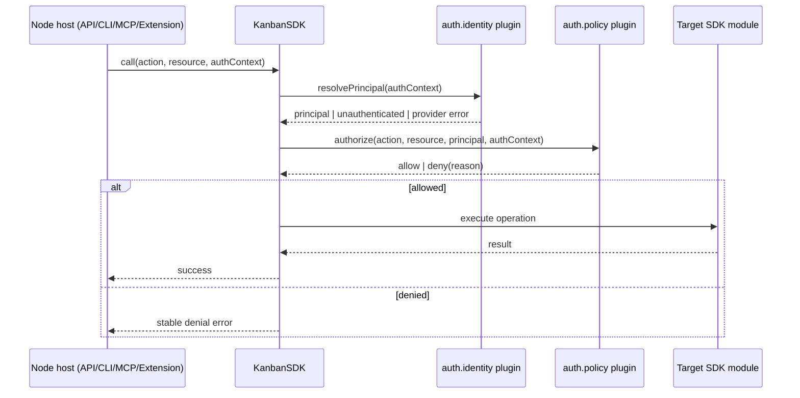

# Architecture requirements: stage 2 auth/authz plugin rollout

- **Status:** Draft for implementation planning
- **Date:** 2026-03-20
- **Baseline ADR:** `docs/plan/20260320-auth-authz-plugin-architecture/architecture-decision-record.md`

## Purpose

Stage 2 turns the accepted stage-1 architecture into an implementation-ready rollout beyond the initial no-op contract. It focuses on four areas that must mature together:

1. pre-action policy enforcement in SDK methods,
2. host adapters for standalone, extension, CLI, and MCP,
3. token flow and lifecycle handling, and
4. parity/diagnostics across every Node-hosted surface.

This document does **not** expand v1 scope to row/card filtering. That remains intentionally deferred.

## Stage-2 goals

### Required outcomes

- The SDK can resolve `auth.identity` and `auth.policy` providers and enforce action-level authorization before privileged work executes.
- Every Node host can acquire token input, map it into a shared auth context, and delegate authorization to the SDK.
- Denials, unauthenticated states, and provider/runtime failures are reported consistently across standalone API responses, extension UX, CLI output, and MCP tool responses.
- Operators can determine which auth providers are active, whether a token source is present, and why a request was denied without exposing secrets.

### Explicit non-goals

- Row/card filtering or partial-result authorization.
- Browser-hosted plugin execution.
- Mandating a single credential UX across all hosts.
- Embedding tokens in `.kanban.json`.

## Workstream A: pre-action policy enforcement

### A1. Standardize action names

The SDK must define and document a canonical action matrix for all privileged operations. Action names should be stable, transport-neutral, and testable.

Minimum categories:

- board actions
- card CRUD and transfer actions
- comment/log actions
- attachment actions
- form submit actions
- settings/config mutation actions
- webhook management actions

### A2. Add one enforcement seam in the SDK

Authorization must run in one place: the SDK method boundary before side effects occur.

Requirements:

- no transport layer may perform the authoritative allow/deny decision,
- policy checks happen before mutation or privileged reads execute,
- denials return stable reason codes/messages, and
- no-op/default auth remains backward compatible when no providers are configured.

### A3. Preserve current query behavior

Stage 2 must not implicitly introduce filtering behavior. If a read action is denied, the result should be a deny/error outcome, not a silently filtered list.

## Workstream B: host adapters

### B1. Standalone server adapter

The standalone server must:

- extract bearer tokens from request metadata,
- attach route/action/resource context,
- delegate to SDK methods with the shared auth context,
- expose auth diagnostics/status in a supportable way, and
- avoid persisting tokens unless explicitly configured.

### B2. Extension adapter

The extension host must:

- use `SecretStorage` for durable token storage,
- keep raw token material out of the webview bundle,
- attach auth context to extension-host SDK calls,
- surface status/denial state in extension UX, and
- keep plugin execution in the Node extension host only.

### B3. CLI adapter

The CLI must:

- support env/config token sourcing,
- define precedence rules clearly,
- attach action/resource context to SDK calls,
- print stable auth/deny diagnostics, and
- avoid echoing secrets in terminal output.

### B4. MCP adapter

The MCP server must:

- support env/config token sourcing,
- pass shared auth context into tool handlers,
- return tool errors that distinguish unauthenticated, denied, and provider-failure cases, and
- preserve behavioral parity with the CLI and standalone server.

## Workstream C: token flow and lifecycle

### C1. Normalize token-source metadata

Every host adapter must produce a common token-source description, for example:

- `secret-storage`
- `memory`
- `config`
- `env`
- `request-header`

The SDK can use this metadata for diagnostics and audit trails, but not for authorization branching.

### C2. Keep raw tokens write-only

Raw token values may cross the host-to-SDK boundary for identity resolution, but they must never appear in:

- logs,
- denial messages,
- MCP tool output,
- CLI stdout/stderr summaries,
- webview messages, or
- REST error bodies.

### C3. Token refresh is optional, not assumed

Stage 2 should not require refresh-token or browser-login flows. If a provider supports refresh internally, that behavior must remain provider-local and invisible to the shared contract.

## Workstream D: parity and diagnostics

### D1. Shared status model

The implementation should define an auth status model analogous to storage diagnostics, covering:

- active provider ids,
- whether auth is configured,
- whether a token source is available,
- principal authentication state, and
- last denial/failure reason category where appropriate.

### D2. Shared error categories

At minimum, all hosts must distinguish:

- unauthenticated,
- denied,
- misconfigured provider,
- provider runtime failure, and
- unsupported host/runtime.

### D3. Parity test matrix

Stage 2 is not complete until the following are covered:

- SDK unit tests for identity/policy/no-op behavior,
- standalone integration coverage for request-token flows,
- CLI coverage for env/config precedence and denial messaging,
- MCP coverage for tool-level auth errors, and
- extension coverage for SecretStorage-backed token handling and webview-safe status signaling.

## Reference flow

## Delivery gates

Stage 2 should be implemented only when all of the following are true:

1. the stage-1 ADR remains the accepted baseline,
2. auth capability/config contracts are stable,
3. no-op/default behavior is proven for existing workspaces,
4. one shared auth context shape is adopted by all hosts, and
5. parity tests cover standalone, extension, CLI, and MCP.

## Deferred follow-on work

The following are intentionally deferred beyond stage 2 unless separately approved:

- row/card filtering,
- scoped list/query rewriting,
- browser-based interactive login UX,
- multi-token/session switching in the webview,
- provider-specific refresh UX surfaced as a shared contract, and
- storage-provider-aware authorization shortcuts.
